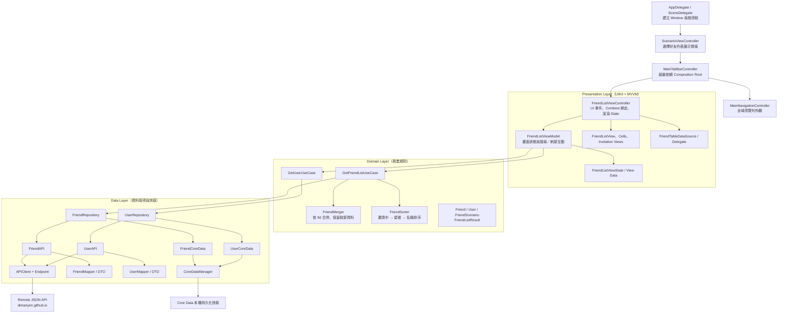

# KOKO

KOKO 是一個展示金融錢包「好友列表」功能的 iOS 應用程式。

## 專案功能 (Features)

1. **好友列表情境切換**
   - 支援無好友狀態（空畫面提示設定 KOKO ID）。
   - 支援一般好友列表展示。
   - 支援包含「好友邀請」的情境（好友邀請卡片展開/收合）。

2. **搜尋與過濾**
   - 點擊搜尋列可展開搜尋框，即時過濾好友名稱。
   - 實作流暢的轉場與鍵盤處理，當搜尋框展開時隱藏頂部其他資訊。

3. **離線快取**
   - 將取得的好友資料寫入本地進行快取。
   - 包含去重複化邏輯，確保顯示最新狀態。

4. **邀請與狀態顯示**
   - 好友包含多種狀態：邀請中、已完成、已送出邀請。
   - 針對有星號（VIP）的好友顯示專屬標章。

## 整體架構

本專案採用分層式 Clean Architecture 搭配 MVVM 與 Repository Pattern。畫面層只負責互動與渲染，商業規則集中在 Domain 層，資料讀取與快取則由 Data 層處理。

### 資料流

`使用者操作 → ViewController → ViewModel → Use Case → Repository → 遠端 API／本機快取 → Domain 資料 → ViewState → UIKit 畫面`

### 各層職責

| 層級 | 職責 |
| --- | --- |
| App 啟動與導航 | 建立視窗、初始情境頁、導航列與 Tab Bar；`MainTabBarController` 負責組裝相依物件。 |
| Presentation | 接收 UI 事件、顯示載入／錯誤／空狀態、處理搜尋與邀請卡互動；透過 ViewModel 的單一 State 渲染畫面。 |
| Domain | 定義 `Friend`、`User` 等商業模型，選擇資料情境、執行好友去重與排序等規則。 |
| Data | 下載 JSON、DTO 與 Entity 轉換、執行 network-first 策略，並在網路失敗時改讀 Core Data 快取。 |
| Utilities / Resources | 提供日期解析、色彩設定與圖像資源等跨層支援。 |
| Tests | 使用 protocol 注入 mocks，驗證 Data、Domain 與 Presentation 的行為。 |
